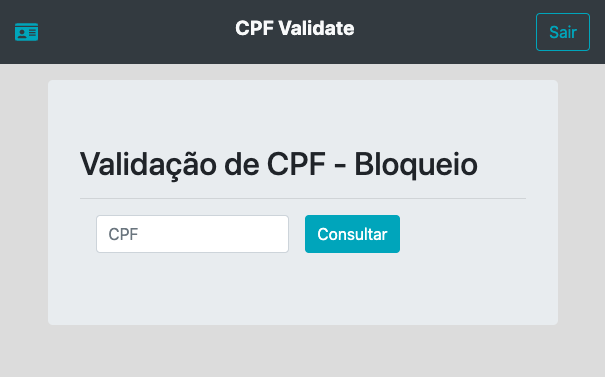
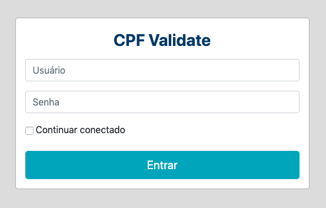
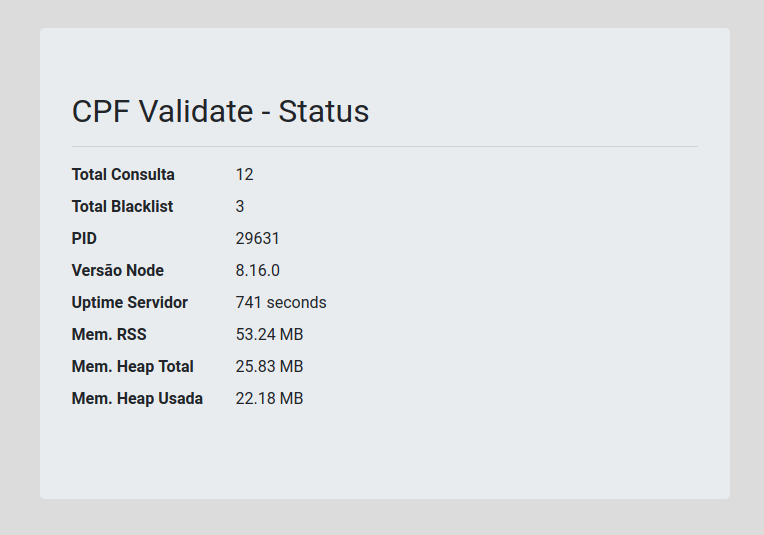

# cpf-validate

API para validação de CPF



Assim que iniciado a aplicação a mesma fica disponível no endereço http://localhost:3000/cpf-validate

> Porta default é 3000

Para consulta do CPF é necessário autenticação



> Usuário/Senha de administrador: `admin/adminpwd`

Ao acessar página de suporte (http://localhost:3000/cpf-validate/suporte/) é possível verificar o status do serviço



## Para desenvolvimento e testes

- Instalar dependências: `MONGOMS_VERSION=4.0.4 npm install`
  - Variável MONGOMS_VERSION é necessária para escolha da versão do mock do MongoDB que será instalado em cache

## Documentação API

- Disponível em
  - https://laissonsilveira.github.io/cpf-validate/
  - `docs/index.html`
- Para atualizar documentação, executar comando `npm run doc`

## Dependências

- Node.js >= 8
- MongoDB >= 4
- Docker >= 18

## Docker

### Build da imagem

Caso a imagem ainda não esteja hospedada

- `docker build --rm -f "Dockerfile" -t cpf-validate:latest .`

### Executando aplicação (Docker)

- Configurar arquivo `.env` com os dados de conexão com banco e quantidade de cluster para servidor da API
- Mapear volume do database do containe Mongo (por padrão está local em `./volumes`)
- Mapear volume do log do container API (por padrão está local em `./volumes`)
  - Outras configurações podem ser alteradas no arquivo `config/default.json`
- Executar comando `docker-compose up`
  - O comando acima irá subir 2 container
    - Database: MongoDB 4.0.4
    - API: Node.js 8.16.0

> Por padrão é criado um usuário de sistema `api_user` com a senha `user_pwd`

## Build sem Docker

### Dev

- Executar comando `npm run dev` e acessar endereço http://localhost:3000/cpf-validate

### NodeJS / PM2

- Instalar Node.js 8.16.0
- Instalar PM2: `npm install pm2 -g` (Mais detalhes aqui -> http://pm2.keymetrics.io/)
- Configurar PM2 para iniciar junto ao sistema: `pm2 startup`

### Mongo

- Instalar MongoDB 4.0.4
- Ativar autenticação automática do serviço em `/etc/mongodb.conf`:
  ```
  security:
    authorization: enabled
  ```
- Criar usuário do banco 
  ```
  use admin 
  db.createUser({user:"api_user",pwd:"api_pwd", roles:[{role:"root",db:"admin"}]});
  ```
  Esse usuário deve ser configurado no arquivo de configuração (`config/default.json`)
    ```json
    "database": {
        ...
        "user": "api_user",
        "pass": "user_pwd"
        ...
    }
    ```
- Acessar mongo: `mongo --host HOSTNAME --port PORT cpf-validate -u 'USER' -p 'PWD' --authenticationDatabase 'admin'`
- Para acesso inicial ao sistema, por padrão é criado um usuário de api `admin` com a senha `adminpwd`

### Testes

- Os testes são executados usando `mocha`
- Para executar os testes: `npm test`
- Um relatório em HTML estará disponível em `test/covarage/mochawesome.html`

### Gerando/Instalando pacote

- Instalar dependências: `npm install`
- Executar comando: `npm run build`
- Pacote `cpf-validate.tgz` gerado na pasta `dist`
- Descompatar arquivo e executar `pm2 start cpf-validate/bin/cpf-validate`
- Outros comandos do pm2 disponíveis: http://pm2.keymetrics.io